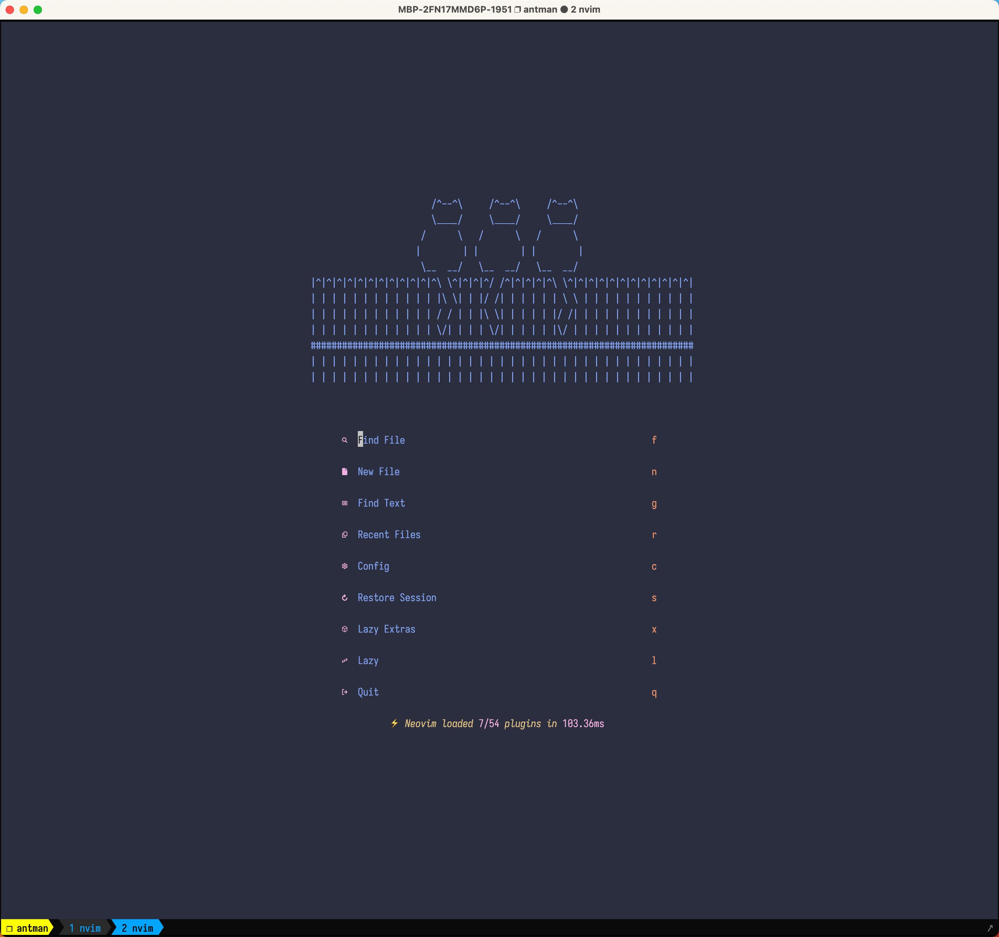
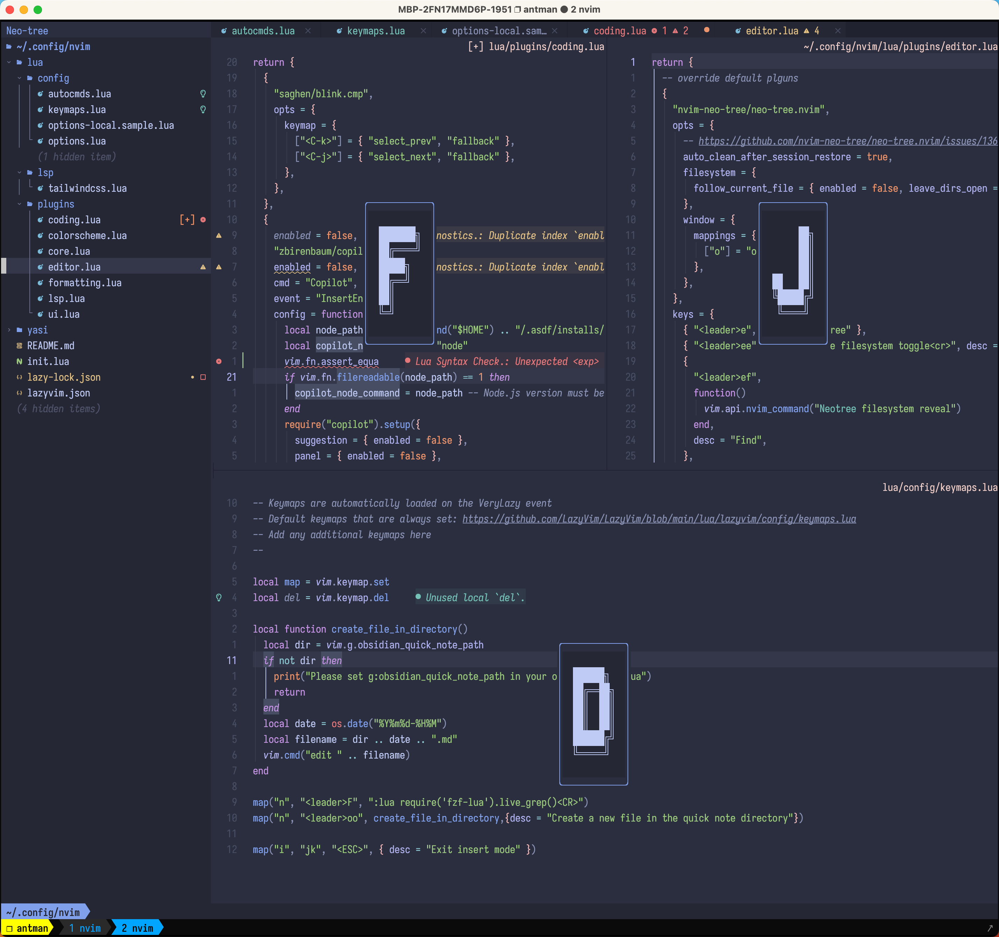
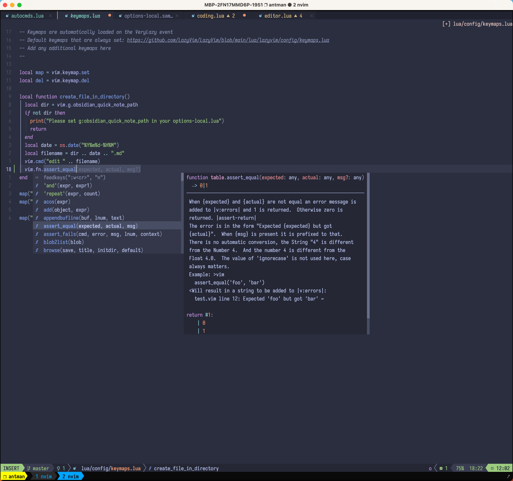

# Neovim Configuration

这是我的个人 Neovim 配置，基于 LazyVim 构建，集成了多种实用插件和功能，提供高效的编码体验。

## 截图展示

### 主界面


### 编辑窗口


### 代码补全


## 主要特性

- 基于 [LazyVim](https://github.com/LazyVim/LazyVim) 构建的现代化配置
- 使用 [lazy.nvim](https://github.com/folke/lazy.nvim) 进行插件管理
- 美观的界面主题：支持 Tokyo Night 和 Catppuccin 主题
- 智能的代码补全和 LSP 集成
- 中文输入法自动切换支持 (使用自定义的 yasi.nvim 插件)

## 插件亮点

### 界面增强
- Neo-tree: 文件浏览器，支持文件查找和搜索
- Toggleterm: 集成终端
- Window-picker: 窗口快速选择
- Snacks: 美观的启动界面

### 编辑体验
- Obsidian.nvim: Obsidian 笔记集成
- Nvim-ufo: 代码折叠增强
- Gitsigns: Git 集成，显示当前行 blame 信息

### 窗口管理
- Vim-tmux-navigator: 在 tmux 中无缝导航
- Smart-splits: 在 WezTerm 中智能分割窗口

## 键位绑定

### 文件导航
- `<leader>ee` - 打开/关闭 Neo-tree
- `<leader>ef` - 在 Neo-tree 中查找当前文件

### 终端
- `<leader>tt` - 打开浮动终端
- `<leader>t1-4` - 打开不同的终端实例

### Obsidian
- `<leader>ot` - 创建今日笔记
- `<leader>on` - 创建新笔记
- `<leader>ob` - 查看反向链接

## 自定义功能

- 中文输入法自动切换 (yasi.nvim)
- 根据终端环境自动选择窗口导航方式 (tmux 或 WezTerm)

## 安装与使用

1. 克隆此仓库到你的 Neovim 配置目录:
   ```bash
   git clone https://github.com/yourusername/nvim_conf.git ~/.config/nvim
   ```

2. 启动 Neovim，插件将自动安装

## 依赖

- Neovim >= 0.9.0
- Git
- 一个现代化的终端 (推荐 WezTerm 或 iTerm2 + tmux)
- 对于中文输入法切换功能，需要安装 im-select
